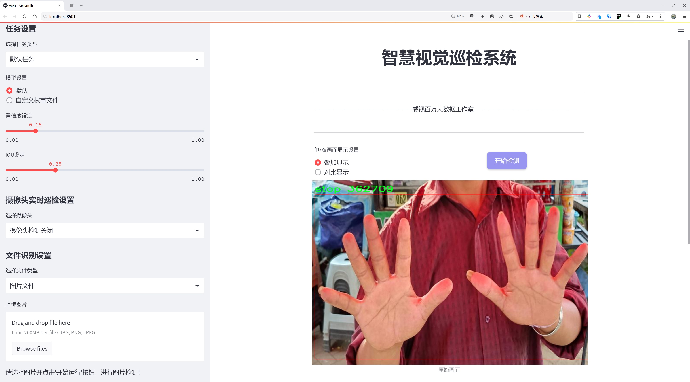
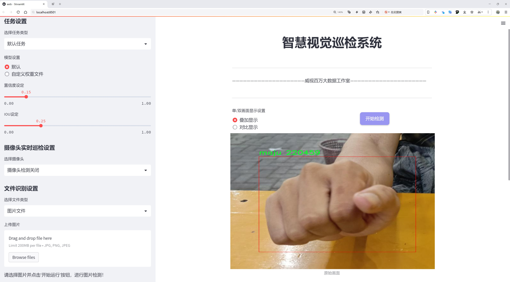
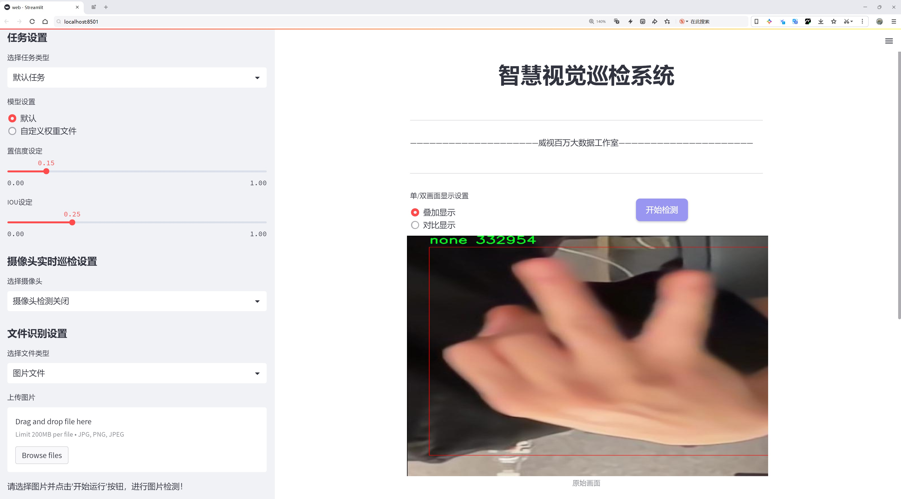
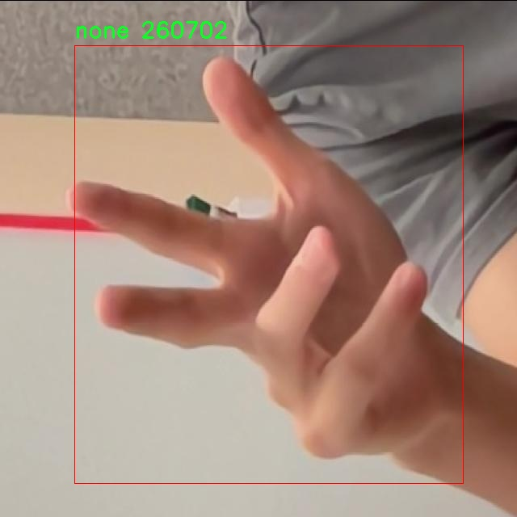
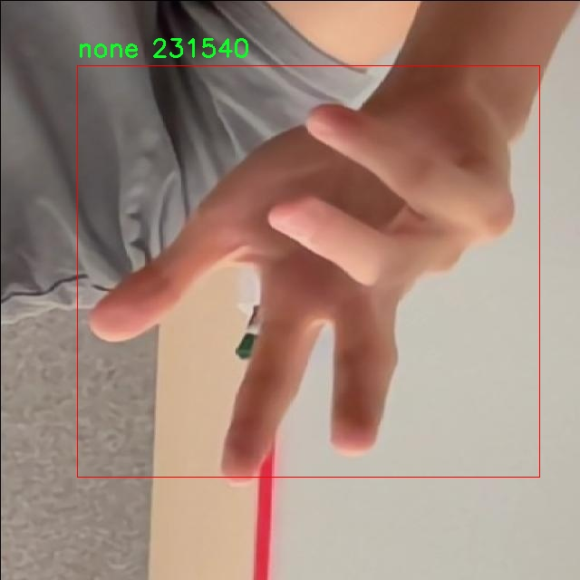

# 手势检测检测系统源码分享
 # [一条龙教学YOLOV8标注好的数据集一键训练_70+全套改进创新点发刊_Web前端展示]

### 1.研究背景与意义

项目参考[AAAI Association for the Advancement of Artificial Intelligence](https://gitee.com/qunshansj/projects)

项目来源[AACV Association for the Advancement of Computer Vision](https://gitee.com/qunmasj/projects)

研究背景与意义

随着人工智能技术的迅猛发展，计算机视觉领域的研究逐渐成为学术界和工业界的热点。其中，手势识别作为人机交互的重要方式，得到了广泛关注。手势不仅是人类交流的重要组成部分，还能在无接触的环境中实现对设备的控制，具有广泛的应用前景，如虚拟现实、增强现实、智能家居、机器人控制等。尤其是在当前全球疫情背景下，非接触式交互方式的需求愈发迫切。因此，构建一个高效、准确的手势检测系统显得尤为重要。

YOLO（You Only Look Once）系列模型因其优越的实时性和准确性，成为了目标检测领域的主流选择。YOLOv8作为该系列的最新版本，进一步提升了模型的检测精度和速度，尤其在处理复杂场景和多目标检测方面表现出色。然而，尽管YOLOv8在许多应用中表现良好，但在特定的手势检测任务中，仍然存在一些挑战。例如，手势的多样性、背景的复杂性以及光照条件的变化等，都会影响模型的检测效果。因此，针对手势检测任务对YOLOv8进行改进，能够有效提升其在实际应用中的表现。

本研究将基于改进的YOLOv8模型，构建一个手势检测系统，旨在提高手势识别的准确性和实时性。为此，我们将利用一个包含2000张图像的手势数据集，该数据集包含五个类别：Non-SKK、SKK、maju、none和stop。这些类别不仅涵盖了常见的手势类型，还考虑了不同场景下的手势变化，为模型的训练提供了丰富的样本。这种多样化的数据集将有助于模型更好地学习手势特征，提高其在实际应用中的泛化能力。

此外，手势检测系统的构建不仅具有学术研究的意义，还具备重要的实际应用价值。通过改进YOLOv8模型，能够为各种人机交互场景提供更为精准的手势识别能力，从而推动智能设备的普及和应用。例如，在智能家居领域，用户可以通过简单的手势控制家电，提升生活的便利性和舒适度。在虚拟现实和增强现实应用中，手势识别技术能够为用户提供更加沉浸式的体验，增强互动感。

综上所述，本研究不仅为YOLOv8在手势检测领域的应用提供了新的思路，也为推动手势识别技术的发展做出了贡献。通过对手势检测系统的深入研究，我们期望能够在提高检测精度的同时，拓展其在实际应用中的范围，为未来的智能交互方式奠定基础。

### 2.图片演示







##### 注意：由于此博客编辑较早，上面“2.图片演示”和“3.视频演示”展示的系统图片或者视频可能为老版本，新版本在老版本的基础上升级如下：（实际效果以升级的新版本为准）

  （1）适配了YOLOV8的“目标检测”模型和“实例分割”模型，通过加载相应的权重（.pt）文件即可自适应加载模型。

  （2）支持“图片识别”、“视频识别”、“摄像头实时识别”三种识别模式。

  （3）支持“图片识别”、“视频识别”、“摄像头实时识别”三种识别结果保存导出，解决手动导出（容易卡顿出现爆内存）存在的问题，识别完自动保存结果并导出到tempDir中。

  （4）支持Web前端系统中的标题、背景图等自定义修改，后面提供修改教程。

  另外本项目提供训练的数据集和训练教程,暂不提供权重文件（best.pt）,需要您按照教程进行训练后实现图片演示和Web前端界面演示的效果。

### 3.视频演示

[3.1 视频演示](https://www.bilibili.com/video/BV13gteeGEuQ/)

### 4.数据集信息展示

##### 4.1 本项目数据集详细数据（类别数＆类别名）

nc: 5
names: ['Non-SKK', 'SKK', 'maju', 'none', 'stop']


##### 4.2 本项目数据集信息介绍

数据集信息展示

在本研究中，我们采用了名为“hand gesture and cloth detection”的数据集，以改进YOLOv8的手势检测系统。该数据集专门设计用于手势识别与服装检测，包含了多种手势类别，旨在为计算机视觉领域的相关应用提供高质量的训练数据。数据集的类别数量为五个，具体类别包括：Non-SKK、SKK、maju、none和stop。这些类别的选择反映了在实际应用中对手势识别的多样性需求，涵盖了从日常交流到特定指令的多种手势。

首先，Non-SKK类别代表了一种不特定的手势，通常用于表达不明确的意图或情感。在实际应用中，这种手势可能出现在社交互动中，能够传达出丰富的非语言信息。SKK类别则是一个特定的手势，通常与某种特定的动作或指令相关联，例如“我想要这个”或“请过来”。这一类别的存在使得系统能够在需要明确指令的场景中，提供更为精准的识别能力。

接下来，maju类别则代表了向前或向前推进的手势，通常用于表示进步或鼓励。在许多文化中，这种手势具有积极的象征意义，因此在多种应用场景中都可能被频繁使用。none类别则表示没有手势的状态，这对于系统的准确性至关重要，因为它能够帮助模型在判断何时不应作出反应时提供参考。最后，stop类别是一个非常重要的手势，通常用于传达停止或暂停的指令。在安全和紧急情况下，这一手势的识别尤为关键，能够有效防止潜在的危险。

该数据集不仅在类别上进行了精心设计，还在数据的多样性和丰富性上做了大量工作。每个类别中的样本均经过精心标注，确保了训练过程中数据的准确性和可靠性。通过对不同手势的多角度、多场景拍摄，数据集能够模拟出真实世界中的各种复杂情况。这种多样性使得YOLOv8在训练过程中能够学习到更为全面的特征，从而提升其在实际应用中的表现。

此外，数据集的构建也考虑到了不同光照条件、背景环境以及手势执行者的多样性，确保了模型在各种环境下的鲁棒性。这种全面的设计理念不仅提高了模型的准确性，也增强了其在实际应用中的适应能力。通过对“hand gesture and cloth detection”数据集的深入分析与应用，我们期望能够显著提升YOLOv8在手势检测任务中的性能，为未来的研究和应用奠定坚实的基础。







### 5.全套项目环境部署视频教程（零基础手把手教学）

[5.1 环境部署教程链接（零基础手把手教学）](https://www.ixigua.com/7404473917358506534?logTag=c807d0cbc21c0ef59de5)


[5.2 安装Python虚拟环境创建和依赖库安装视频教程链接（零基础手把手教学）](https://www.ixigua.com/7404474678003106304?logTag=1f1041108cd1f708b01a)

### 6.手把手YOLOV8训练视频教程（零基础小白有手就能学会）

[6.1 手把手YOLOV8训练视频教程（零基础小白有手就能学会）](https://www.ixigua.com/7404477157818401292?logTag=d31a2dfd1983c9668658)

### 7.70+种全套YOLOV8创新点代码加载调参视频教程（一键加载写好的改进模型的配置文件）

[7.1 70+种全套YOLOV8创新点代码加载调参视频教程（一键加载写好的改进模型的配置文件）](https://www.ixigua.com/7404478314661806627?logTag=29066f8288e3f4eea3a4)

### 8.70+种全套YOLOV8创新点原理讲解（非科班也可以轻松写刊发刊，V10版本正在科研待更新）

由于篇幅限制，每个创新点的具体原理讲解就不一一展开，具体见下列网址中的创新点对应子项目的技术原理博客网址【Blog】：


[8.1 70+种全套YOLOV8创新点原理讲解链接](https://gitee.com/qunmasj/good)

### 9.系统功能展示（检测对象为举例，实际内容以本项目数据集为准）

图9.1.系统支持检测结果表格显示

  图9.2.系统支持置信度和IOU阈值手动调节

  图9.3.系统支持自定义加载权重文件best.pt(需要你通过步骤5中训练获得)

  图9.4.系统支持摄像头实时识别

  图9.5.系统支持图片识别

  图9.6.系统支持视频识别

  图9.7.系统支持识别结果文件自动保存

  图9.8.系统支持Excel导出检测结果数据


### 10.原始YOLOV8算法原理

原始YOLOv8算法原理

YOLOv8算法是目标检测领域的一项重要进展，继承并改进了YOLO系列算法的设计理念。作为YOLOv5团队的最新成果，YOLOv8在保持高效性的同时，进一步提升了检测精度和灵活性。其架构主要由输入层、主干网络、特征融合层和解耦头组成，这些组件的设计和优化使得YOLOv8在目标检测任务中表现出色。

在主干网络部分，YOLOv8采用了CSPDarknet的设计思想，继续使用YOLOv5中的SPPF模块，但对C3模块进行了替换，采用了C2f模块。C2f模块的设计灵感来源于YOLOv7的ELAN思想，旨在通过引入更多的分支来增强特征提取的能力。具体而言，C2f模块由多个CBS（卷积+归一化+SiLU激活函数）模块和若干个Bottleneck模块组成。通过这种结构，C2f模块能够在保持轻量化的同时，丰富梯度流信息，提升模型的检测精度。

在特征融合层，YOLOv8使用了PAN-FPN结构，这一结构的设计旨在充分融合多尺度特征，以提高目标检测的准确性。与YOLOv5不同，YOLOv8在上采样阶段去除了1x1卷积层，直接将高层特征进行上采样并与中层特征进行连接。这种设计使得浅层特征和高层特征能够更好地融合，从而提升了模型对细节信息的捕捉能力，进而提高了目标检测的准确性。

YOLOv8在目标检测方法上进行了重要的创新，抛弃了传统的Anchor-Based方法，转而采用Anchor-Free的思想。这一转变使得YOLOv8在目标检测时不再依赖于预设的锚框，而是将目标检测转化为关键点检测。这种方法不仅简化了模型的设计，还增强了模型的泛化能力，使其在不同数据集上表现更加灵活。通过这种方式，YOLOv8能够更好地适应不同形状和大小的目标，提升了检测的准确性和效率。

在损失函数的设计上，YOLOv8引入了VFLLoss作为分类损失，同时结合DFLLoss和CIoULoss来优化边界框的回归。这种组合损失函数的设计旨在提高模型在训练过程中的收敛速度和精度，尤其是在处理小目标和样本不平衡问题时，能够有效地提升模型的性能。此外，YOLOv8采用了Task-Aligned的样本匹配策略，进一步增强了模型在复杂场景下的适应能力。

数据预处理方面，YOLOv8在训练过程中采用了多种增强手段，包括马赛克增强、混合增强、空间扰动和颜色扰动等。这些增强手段能够有效地提高模型的鲁棒性，使其在面对不同场景和光照条件时，依然能够保持良好的检测性能。

总的来说，YOLOv8在多个方面进行了创新和改进，尤其是在主干网络的设计、特征融合策略、目标检测方法以及损失函数的优化等方面，均展现出了显著的优势。这些改进使得YOLOv8不仅在准确性上有了提升，同时在计算效率和灵活性上也表现得更加出色。作为一款新一代的目标检测算法，YOLOv8无疑为目标检测领域带来了新的机遇和挑战。


### 11.项目核心源码讲解（再也不用担心看不懂代码逻辑）

#### 11.1 70+种YOLOv8算法改进源码大全和调试加载训练教程（非必要）\ultralytics\models\fastsam\val.py

以下是经过简化和注释的核心代码部分：

```python
# 导入必要的模块
from ultralytics.models.yolo.segment import SegmentationValidator
from ultralytics.utils.metrics import SegmentMetrics

class FastSAMValidator(SegmentationValidator):
    """
    自定义验证类，用于快速SAM（Segment Anything Model）分割，基于Ultralytics YOLO框架。

    该类扩展了SegmentationValidator，专门定制了快速SAM的验证过程。设置任务为'segment'，并使用SegmentMetrics进行评估。
    此外，为了避免验证过程中出现错误，禁用了绘图功能。
    """

    def __init__(self, dataloader=None, save_dir=None, pbar=None, args=None, _callbacks=None):
        """
        初始化FastSAMValidator类，设置任务为'segment'，并将度量标准设置为SegmentMetrics。

        参数：
            dataloader (torch.utils.data.DataLoader): 用于验证的数据加载器。
            save_dir (Path, optional): 保存结果的目录。
            pbar (tqdm.tqdm): 用于显示进度的进度条。
            args (SimpleNamespace): 验证器的配置。
            _callbacks (dict): 存储各种回调函数的字典。

        注意：
            禁用ConfusionMatrix和其他相关度量的绘图，以避免错误。
        """
        # 调用父类构造函数进行初始化
        super().__init__(dataloader, save_dir, pbar, args, _callbacks)
        
        # 设置任务类型为分割
        self.args.task = 'segment'
        
        # 禁用绘图功能以避免错误
        self.args.plots = False
        
        # 初始化度量标准为SegmentMetrics
        self.metrics = SegmentMetrics(save_dir=self.save_dir, on_plot=self.on_plot)
```

### 代码分析：
1. **类定义**：`FastSAMValidator`类继承自`SegmentationValidator`，用于实现特定的分割验证逻辑。
2. **构造函数**：`__init__`方法中初始化了数据加载器、保存目录、进度条、参数和回调函数，并设置了任务类型和度量标准。
3. **任务设置**：将任务类型设置为`'segment'`，表明该验证器专注于分割任务。
4. **禁用绘图**：为了避免在验证过程中出现绘图相关的错误，禁用了绘图功能。
5. **度量标准**：使用`SegmentMetrics`来评估分割性能，确保结果能够被正确记录和分析。

这个文件定义了一个名为 `FastSAMValidator` 的类，它是基于 Ultralytics YOLO 框架的自定义验证类，专门用于快速 SAM（Segment Anything Model）分割任务。该类继承自 `SegmentationValidator`，并对验证过程进行了特定的定制。

在类的文档字符串中，说明了该类的主要功能和属性。它将任务设置为“分割”，并使用 `SegmentMetrics` 进行评估。为了避免在验证过程中出现错误，绘图功能被禁用。

构造函数 `__init__` 用于初始化 `FastSAMValidator` 类的实例。它接受多个参数，包括数据加载器 `dataloader`、结果保存目录 `save_dir`、进度条 `pbar`、配置参数 `args` 以及用于存储回调函数的字典 `_callbacks`。在初始化过程中，调用了父类的构造函数，并设置了任务类型为“segment”，同时将绘图功能禁用，以避免在验证时出现与混淆矩阵和其他相关指标绘图相关的错误。此外，实例还创建了一个 `SegmentMetrics` 对象，用于保存和处理评估指标。

总的来说，这个文件的主要目的是为快速 SAM 分割模型提供一个专门的验证工具，确保在验证过程中能够正确评估模型的性能，同时避免不必要的错误。

#### 11.2 70+种YOLOv8算法改进源码大全和调试加载训练教程（非必要）\ultralytics\nn\backbone\fasternet.py

以下是代码中最核心的部分，并附上详细的中文注释：

```python
import torch
import torch.nn as nn
from typing import List
from torch import Tensor

class Partial_conv3(nn.Module):
    """部分卷积层，用于处理输入的部分通道。"""

    def __init__(self, dim, n_div, forward):
        super().__init__()
        self.dim_conv3 = dim // n_div  # 计算部分卷积的通道数
        self.dim_untouched = dim - self.dim_conv3  # 计算未处理的通道数
        self.partial_conv3 = nn.Conv2d(self.dim_conv3, self.dim_conv3, 3, 1, 1, bias=False)  # 定义卷积层

        # 根据前向传播方式选择不同的前向函数
        if forward == 'slicing':
            self.forward = self.forward_slicing
        elif forward == 'split_cat':
            self.forward = self.forward_split_cat
        else:
            raise NotImplementedError

    def forward_slicing(self, x: Tensor) -> Tensor:
        """仅用于推理阶段的前向传播，保留原始输入以便后续残差连接。"""
        x = x.clone()  # 克隆输入，保持原始输入不变
        x[:, :self.dim_conv3, :, :] = self.partial_conv3(x[:, :self.dim_conv3, :, :])  # 处理部分通道
        return x

    def forward_split_cat(self, x: Tensor) -> Tensor:
        """用于训练和推理阶段的前向传播，将输入分为两部分进行处理。"""
        x1, x2 = torch.split(x, [self.dim_conv3, self.dim_untouched], dim=1)  # 分割输入
        x1 = self.partial_conv3(x1)  # 处理部分通道
        x = torch.cat((x1, x2), 1)  # 合并处理后的通道和未处理的通道
        return x


class MLPBlock(nn.Module):
    """多层感知机块，包含卷积和激活层。"""

    def __init__(self, dim, n_div, mlp_ratio, drop_path, layer_scale_init_value, act_layer, norm_layer, pconv_fw_type):
        super().__init__()
        self.dim = dim
        self.mlp_ratio = mlp_ratio
        self.drop_path = nn.Identity() if drop_path <= 0 else DropPath(drop_path)  # 处理随机深度
        self.n_div = n_div

        mlp_hidden_dim = int(dim * mlp_ratio)  # 计算隐藏层维度

        # 定义多层感知机的层
        mlp_layer: List[nn.Module] = [
            nn.Conv2d(dim, mlp_hidden_dim, 1, bias=False),
            norm_layer(mlp_hidden_dim),
            act_layer(),
            nn.Conv2d(mlp_hidden_dim, dim, 1, bias=False)
        ]

        self.mlp = nn.Sequential(*mlp_layer)  # 将层组合成序列

        # 定义空间混合层
        self.spatial_mixing = Partial_conv3(dim, n_div, pconv_fw_type)

        # 如果层缩放初始化值大于0，则使用层缩放
        if layer_scale_init_value > 0:
            self.layer_scale = nn.Parameter(layer_scale_init_value * torch.ones((dim)), requires_grad=True)
            self.forward = self.forward_layer_scale  # 使用带层缩放的前向传播
        else:
            self.forward = self.forward  # 使用默认前向传播

    def forward(self, x: Tensor) -> Tensor:
        """前向传播，执行空间混合和多层感知机操作。"""
        shortcut = x  # 保存输入以便后续残差连接
        x = self.spatial_mixing(x)  # 进行空间混合
        x = shortcut + self.drop_path(self.mlp(x))  # 添加残差连接
        return x

    def forward_layer_scale(self, x: Tensor) -> Tensor:
        """带层缩放的前向传播。"""
        shortcut = x
        x = self.spatial_mixing(x)
        x = shortcut + self.drop_path(self.layer_scale.unsqueeze(-1).unsqueeze(-1) * self.mlp(x))  # 应用层缩放
        return x


class FasterNet(nn.Module):
    """FasterNet模型，包含多个阶段和块。"""

    def __init__(self, in_chans=3, num_classes=1000, embed_dim=96, depths=(1, 2, 8, 2), mlp_ratio=2., n_div=4,
                 patch_size=4, patch_stride=4, patch_size2=2, patch_stride2=2, patch_norm=True,
                 drop_path_rate=0.1, layer_scale_init_value=0, norm_layer='BN', act_layer='RELU', pconv_fw_type='split_cat'):
        super().__init__()

        # 选择归一化层和激活层
        norm_layer = nn.BatchNorm2d if norm_layer == 'BN' else NotImplementedError
        act_layer = nn.GELU if act_layer == 'GELU' else partial(nn.ReLU, inplace=True)

        self.num_stages = len(depths)  # 计算阶段数量
        self.embed_dim = embed_dim  # 嵌入维度
        self.patch_norm = patch_norm  # 是否使用归一化
        self.mlp_ratio = mlp_ratio  # MLP比率
        self.depths = depths  # 各阶段的深度

        # 分割图像为不重叠的补丁
        self.patch_embed = PatchEmbed(patch_size=patch_size, patch_stride=patch_stride, in_chans=in_chans,
                                       embed_dim=embed_dim, norm_layer=norm_layer if self.patch_norm else None)

        # 随机深度衰减规则
        dpr = [x.item() for x in torch.linspace(0, drop_path_rate, sum(depths))]

        # 构建各个阶段
        stages_list = []
        for i_stage in range(self.num_stages):
            stage = BasicStage(dim=int(embed_dim * 2 ** i_stage), n_div=n_div, depth=depths[i_stage],
                               mlp_ratio=self.mlp_ratio, drop_path=dpr[sum(depths[:i_stage]):sum(depths[:i_stage + 1])],
                               layer_scale_init_value=layer_scale_init_value, norm_layer=norm_layer,
                               act_layer=act_layer, pconv_fw_type=pconv_fw_type)
            stages_list.append(stage)

            # 添加补丁合并层
            if i_stage < self.num_stages - 1:
                stages_list.append(PatchMerging(patch_size2=patch_size2, patch_stride2=patch_stride2,
                                                 dim=int(embed_dim * 2 ** i_stage), norm_layer=norm_layer))

        self.stages = nn.Sequential(*stages_list)  # 将所有阶段组合成序列

    def forward(self, x: Tensor) -> Tensor:
        """前向传播，输出四个阶段的特征用于密集预测。"""
        x = self.patch_embed(x)  # 进行补丁嵌入
        outs = []
        for idx, stage in enumerate(self.stages):
            x = stage(x)  # 通过每个阶段
            if idx in self.out_indices:  # 如果当前阶段在输出索引中
                norm_layer = getattr(self, f'norm{idx}')  # 获取对应的归一化层
                x_out = norm_layer(x)  # 应用归一化
                outs.append(x_out)  # 保存输出
        return outs  # 返回所有阶段的输出
```

以上代码定义了一个深度学习模型 `FasterNet`，其中包含多个模块，如部分卷积、MLP块、补丁嵌入和补丁合并等。每个模块都有其特定的功能，整体结构旨在高效地处理输入数据并提取特征。

这个程序文件实现了一个名为FasterNet的深度学习模型，主要用于计算机视觉任务。代码中使用了PyTorch框架，并包含了多个模块和类，旨在构建一个高效的神经网络架构。

首先，文件导入了一些必要的库，包括PyTorch、YAML、以及用于构建神经网络的模块。接着，定义了多个类来构建FasterNet模型的不同部分。

`Partial_conv3`类实现了一个部分卷积层，支持两种前向传播方式：切片（slicing）和拼接（split_cat）。这使得模型在处理输入时能够选择不同的方式来处理特征图。

`MLPBlock`类实现了一个多层感知机（MLP）模块，包含了卷积层、归一化层和激活函数。该模块还支持可选的层级缩放，能够在训练过程中调整特征的尺度。

`BasicStage`类由多个`MLPBlock`组成，形成了模型的基本构建块。它负责将输入数据通过多个MLP块进行处理。

`PatchEmbed`和`PatchMerging`类用于图像的嵌入和合并操作，分别将输入图像划分为小块并进行特征提取，以及在不同阶段合并特征图以减少维度。

`FasterNet`类是整个模型的核心，负责初始化模型的各个组件，包括图像嵌入、多个基本阶段和归一化层。它还实现了前向传播方法，能够输出不同阶段的特征图。

文件中还定义了一些函数，用于加载模型的权重并更新模型的状态字典。这些函数通过读取YAML配置文件来初始化不同版本的FasterNet模型（如t0、t1、t2等），并支持加载预训练权重。

最后，在主程序中，创建了一个FasterNet模型实例，并通过随机生成的输入数据测试模型的输出特征图的尺寸。这段代码展示了如何使用该模型以及如何进行基本的推理操作。

整体而言，这个程序文件为FasterNet模型的构建和使用提供了全面的实现，适合用于图像分类、目标检测等计算机视觉任务。

#### 11.3 ui.py

```python
import sys
import subprocess

def run_script(script_path):
    """
    使用当前 Python 环境运行指定的脚本。

    Args:
        script_path (str): 要运行的脚本路径

    Returns:
        None
    """
    # 获取当前 Python 解释器的路径
    python_path = sys.executable

    # 构建运行命令
    command = f'"{python_path}" -m streamlit run "{script_path}"'

    # 执行命令
    result = subprocess.run(command, shell=True)
    if result.returncode != 0:
        print("脚本运行出错。")


# 实例化并运行应用
if __name__ == "__main__":
    # 指定您的脚本路径
    script_path = "web.py"  # 这里直接指定脚本路径

    # 运行脚本
    run_script(script_path)
```

### 代码注释说明：

1. **导入模块**：
   - `import sys`：导入 `sys` 模块，用于访问与 Python 解释器相关的变量和函数。
   - `import subprocess`：导入 `subprocess` 模块，用于创建新进程、连接到它们的输入/输出/错误管道，并获取它们的返回码。

2. **定义 `run_script` 函数**：
   - 该函数接受一个参数 `script_path`，表示要运行的 Python 脚本的路径。
   - 函数内部首先获取当前 Python 解释器的路径，以便在后续命令中使用。

3. **构建运行命令**：
   - 使用格式化字符串构建一个命令，该命令使用当前 Python 解释器运行 `streamlit` 模块，并指定要运行的脚本。

4. **执行命令**：
   - 使用 `subprocess.run` 方法执行构建的命令，并将 `shell` 参数设置为 `True`，以便在 shell 中运行命令。
   - 检查命令的返回码，如果不为 0，表示脚本运行出错，打印错误信息。

5. **主程序入口**：
   - `if __name__ == "__main__":` 确保该代码块仅在脚本作为主程序运行时执行。
   - 指定要运行的脚本路径（这里为 `"web.py"`）。
   - 调用 `run_script` 函数来执行指定的脚本。

这个程序文件名为 `ui.py`，主要功能是通过当前的 Python 环境运行一个指定的脚本。程序的实现依赖于几个模块，包括 `sys`、`os` 和 `subprocess`，同时还引入了一个自定义模块 `QtFusion.path` 中的 `abs_path` 函数。

程序的核心是 `run_script` 函数，它接受一个参数 `script_path`，表示要运行的脚本的路径。在函数内部，首先通过 `sys.executable` 获取当前 Python 解释器的路径，这样可以确保使用正确的 Python 环境来执行脚本。接着，构建一个命令字符串，使用 `streamlit` 模块来运行指定的脚本。这个命令会被传递给 `subprocess.run` 函数进行执行。

`subprocess.run` 是一个用于执行外部命令的函数，`shell=True` 参数表示在 shell 中执行命令。执行完命令后，程序会检查返回的状态码，如果返回码不为 0，说明脚本运行过程中出现了错误，程序会输出相应的错误提示。

在文件的最后部分，使用 `if __name__ == "__main__":` 来判断当前模块是否是主程序。如果是主程序，首先指定要运行的脚本路径，这里调用了 `abs_path` 函数来获取 `web.py` 的绝对路径。然后调用 `run_script` 函数来执行这个脚本。

总体来看，这个程序的主要目的是为用户提供一个简单的接口，通过指定脚本路径来运行一个 Streamlit 应用，便于开发和调试。

#### 11.4 code\ultralytics\models\sam\amg.py

以下是经过简化并添加详细中文注释的核心代码部分：

```python
import torch
import numpy as np

def is_box_near_crop_edge(
    boxes: torch.Tensor, crop_box: List[int], orig_box: List[int], atol: float = 20.0
) -> torch.Tensor:
    """
    判断给定的边界框是否接近裁剪边缘。

    参数:
    - boxes: 需要检查的边界框，格式为 (x1, y1, x2, y2) 的张量。
    - crop_box: 当前裁剪框的边界，格式为 [x0, y0, x1, y1]。
    - orig_box: 原始图像的边界框，格式为 [x0, y0, x1, y1]。
    - atol: 允许的绝对误差，默认为 20.0。

    返回:
    - 返回一个布尔张量，指示每个边界框是否接近裁剪边缘。
    """
    crop_box_torch = torch.as_tensor(crop_box, dtype=torch.float, device=boxes.device)
    orig_box_torch = torch.as_tensor(orig_box, dtype=torch.float, device=boxes.device)
    boxes = uncrop_boxes_xyxy(boxes, crop_box).float()  # 将边界框转换为原始图像坐标
    near_crop_edge = torch.isclose(boxes, crop_box_torch[None, :], atol=atol, rtol=0)  # 检查是否接近裁剪框
    near_image_edge = torch.isclose(boxes, orig_box_torch[None, :], atol=atol, rtol=0)  # 检查是否接近原始图像边缘
    near_crop_edge = torch.logical_and(near_crop_edge, ~near_image_edge)  # 确保不同时接近原始图像边缘
    return torch.any(near_crop_edge, dim=1)  # 返回每个框是否接近裁剪边缘的布尔值

def uncrop_boxes_xyxy(boxes: torch.Tensor, crop_box: List[int]) -> torch.Tensor:
    """
    将裁剪框的边界框转换为原始图像坐标。

    参数:
    - boxes: 需要转换的边界框，格式为 (x1, y1, x2, y2) 的张量。
    - crop_box: 当前裁剪框的边界，格式为 [x0, y0, x1, y1]。

    返回:
    - 返回转换后的边界框张量。
    """
    x0, y0, _, _ = crop_box
    offset = torch.tensor([[x0, y0, x0, y0]], device=boxes.device)  # 计算偏移量
    if len(boxes.shape) == 3:  # 检查是否有通道维度
        offset = offset.unsqueeze(1)  # 增加维度以匹配
    return boxes + offset  # 返回偏移后的边界框

def calculate_stability_score(masks: torch.Tensor, mask_threshold: float, threshold_offset: float) -> torch.Tensor:
    """
    计算一批掩膜的稳定性得分。

    稳定性得分是通过对预测掩膜的 logits 进行高低阈值二值化后计算的 IoU。

    参数:
    - masks: 预测的掩膜张量。
    - mask_threshold: 掩膜的阈值。
    - threshold_offset: 阈值偏移量。

    返回:
    - 返回每个掩膜的稳定性得分。
    """
    intersections = (masks > (mask_threshold + threshold_offset)).sum(-1, dtype=torch.int16).sum(-1, dtype=torch.int32)  # 计算交集
    unions = (masks > (mask_threshold - threshold_offset)).sum(-1, dtype=torch.int16).sum(-1, dtype=torch.int32)  # 计算并集
    return intersections / unions  # 返回 IoU 作为稳定性得分
```

### 代码说明
1. **is_box_near_crop_edge**: 此函数用于判断给定的边界框是否接近裁剪边缘。它通过比较边界框与裁剪框和原始图像边缘的距离来实现。
2. **uncrop_boxes_xyxy**: 此函数将裁剪框的边界框转换为原始图像坐标，主要通过添加裁剪框的偏移量来实现。
3. **calculate_stability_score**: 此函数计算一批掩膜的稳定性得分，得分基于二值化掩膜的交集和并集计算 IoU。

这个程序文件主要实现了一些与图像处理和目标检测相关的功能，特别是在处理掩膜（masks）和裁剪框（crop boxes）方面。代码使用了PyTorch和NumPy库，提供了一系列函数来生成、处理和分析图像数据。

首先，`is_box_near_crop_edge`函数用于判断给定的边界框是否接近裁剪边缘。它接受三个参数：边界框、裁剪框和原始框，并返回一个布尔张量，指示哪些边界框接近裁剪边缘。这个函数通过将边界框进行“反裁剪”操作来实现，并利用`torch.isclose`函数进行近似比较。

接下来，`batch_iterator`函数用于从输入参数中生成批次数据的生成器。它确保所有输入参数的长度相同，并根据指定的批次大小生成数据批次。

`calculate_stability_score`函数计算一组掩膜的稳定性分数。这个分数是通过计算高低阈值下的二进制掩膜之间的交并比（IoU）来获得的。

`build_point_grid`和`build_all_layer_point_grids`函数用于生成均匀分布的二维点网格，后者为所有裁剪层生成点网格，便于后续处理。

`generate_crop_boxes`函数生成不同大小的裁剪框。它根据图像尺寸、层数和重叠比例来计算每一层的裁剪框，并返回裁剪框和层索引的列表。

`uncrop_boxes_xyxy`、`uncrop_points`和`uncrop_masks`函数用于将裁剪框、点和掩膜进行“反裁剪”，即将它们的坐标或形状调整回原始图像的大小。

`remove_small_regions`函数使用OpenCV库来移除掩膜中的小区域或孔洞，返回处理后的掩膜和一个指示是否进行了修改的布尔值。

`batched_mask_to_box`函数计算掩膜周围的边界框，返回的格式为XYXY（左上角和右下角坐标）。如果掩膜为空，则返回[0, 0, 0, 0]。

总体来说，这个文件提供了一系列工具函数，旨在支持图像处理和目标检测任务，尤其是在处理掩膜和裁剪框的上下文中。通过这些函数，用户可以方便地生成裁剪框、计算掩膜的稳定性分数、以及处理掩膜和边界框的坐标。

#### 11.5 code\ultralytics\hub\auth.py

以下是代码中最核心的部分，并附上详细的中文注释：

```python
import requests

# 定义一个用于管理身份验证的类
class Auth:
    """
    管理身份验证过程，包括API密钥处理、基于cookie的身份验证和头部生成。

    支持不同的身份验证方法：
    1. 直接使用API密钥。
    2. 使用浏览器cookie进行身份验证（特别是在Google Colab中）。
    3. 提示用户输入API密钥。
    """

    id_token = api_key = model_key = False  # 初始化身份验证相关的属性

    def __init__(self, api_key="", verbose=False):
        """
        初始化Auth类，可以选择性地传入API密钥。

        参数：
            api_key (str, optional): 可能是API密钥或组合的API密钥和模型ID。
        """
        # 分割输入的API密钥，保留API密钥部分
        api_key = api_key.split("_")[0]

        # 设置API密钥属性，如果没有传入则使用设置中的API密钥
        self.api_key = api_key or SETTINGS.get("api_key", "")

        # 如果提供了API密钥
        if self.api_key:
            # 检查提供的API密钥是否与设置中的API密钥匹配
            if self.api_key == SETTINGS.get("api_key"):
                # 如果匹配，记录用户已登录
                if verbose:
                    LOGGER.info(f"{PREFIX}Authenticated ✅")
                return
            else:
                # 尝试使用提供的API密钥进行身份验证
                success = self.authenticate()
        # 如果没有提供API密钥且环境是Google Colab
        elif is_colab():
            # 尝试使用浏览器cookie进行身份验证
            success = self.auth_with_cookies()
        else:
            # 请求用户输入API密钥
            success = self.request_api_key()

        # 如果身份验证成功，更新设置中的API密钥
        if success:
            SETTINGS.update({"api_key": self.api_key})
            if verbose:
                LOGGER.info(f"{PREFIX}New authentication successful ✅")
        elif verbose:
            LOGGER.info(f"{PREFIX}Retrieve API key from {API_KEY_URL}")

    def authenticate(self) -> bool:
        """
        尝试使用id_token或API密钥进行身份验证。

        返回：
            bool: 如果身份验证成功则返回True，否则返回False。
        """
        try:
            header = self.get_auth_header()  # 获取身份验证头部
            if header:
                r = requests.post(f"{HUB_API_ROOT}/v1/auth", headers=header)  # 发送身份验证请求
                if not r.json().get("success", False):
                    raise ConnectionError("Unable to authenticate.")
                return True
            raise ConnectionError("User has not authenticated locally.")
        except ConnectionError:
            self.id_token = self.api_key = False  # 重置无效的身份验证信息
            LOGGER.warning(f"{PREFIX}Invalid API key ⚠️")
            return False

    def auth_with_cookies(self) -> bool:
        """
        尝试通过cookie获取身份验证并设置id_token。用户必须在HUB中登录并使用支持的浏览器。

        返回：
            bool: 如果身份验证成功则返回True，否则返回False。
        """
        if not is_colab():
            return False  # 目前仅在Colab中有效
        try:
            authn = request_with_credentials(f"{HUB_API_ROOT}/v1/auth/auto")  # 获取浏览器身份验证信息
            if authn.get("success", False):
                self.id_token = authn.get("data", {}).get("idToken", None)  # 设置id_token
                self.authenticate()  # 进行身份验证
                return True
            raise ConnectionError("Unable to fetch browser authentication details.")
        except ConnectionError:
            self.id_token = False  # 重置无效的id_token
            return False

    def get_auth_header(self):
        """
        获取用于API请求的身份验证头部。

        返回：
            (dict): 如果设置了id_token或API密钥，则返回身份验证头部，否则返回None。
        """
        if self.id_token:
            return {"authorization": f"Bearer {self.id_token}"}  # 使用id_token生成头部
        elif self.api_key:
            return {"x-api-key": self.api_key}  # 使用API密钥生成头部
        return None  # 如果都没有则返回None
```

### 代码核心部分说明：
1. **Auth类**：用于管理身份验证的逻辑，包括API密钥和cookie的处理。
2. **__init__方法**：初始化时根据传入的API密钥或环境（如Colab）决定如何进行身份验证。
3. **authenticate方法**：尝试使用API密钥或id_token进行身份验证，并返回结果。
4. **auth_with_cookies方法**：在Colab环境中通过cookie进行身份验证。
5. **get_auth_header方法**：生成用于API请求的身份验证头部。

这个程序文件主要实现了一个名为 `Auth` 的类，用于管理与 Ultralytics YOLO 平台的身份验证过程。该类支持多种身份验证方式，包括直接使用 API 密钥、通过浏览器 Cookie 进行身份验证（特别是在 Google Colab 环境中），以及提示用户输入 API 密钥。

在类的属性中，`id_token`、`api_key` 和 `model_key` 都被初始化为 `False`，用于存储身份验证所需的令牌和密钥。构造函数 `__init__` 接受一个可选的 API 密钥参数，并根据提供的密钥或设置中的密钥进行身份验证。如果提供的 API 密钥与设置中的密钥匹配，则表示用户已经登录；如果不匹配，则尝试进行身份验证。如果没有提供 API 密钥且当前环境是 Google Colab，则尝试通过 Cookie 进行身份验证；如果都不满足，则请求用户输入 API 密钥。

`request_api_key` 方法用于提示用户输入 API 密钥，最多尝试三次。如果输入的密钥能够成功进行身份验证，则返回 `True`，否则抛出连接错误。`authenticate` 方法尝试使用 `id_token` 或 API 密钥与服务器进行身份验证，返回一个布尔值表示身份验证是否成功。如果身份验证失败，类的属性将被重置为 `False`，并记录警告信息。

`auth_with_cookies` 方法专门用于在 Google Colab 环境中通过 Cookie 进行身份验证。如果成功获取到身份验证信息，则会设置 `id_token` 并调用 `authenticate` 方法进行进一步验证。最后，`get_auth_header` 方法用于生成 API 请求所需的身份验证头，如果 `id_token` 或 API 密钥存在，则返回相应的头信息，否则返回 `None`。

整体来看，这个类提供了一种灵活的方式来处理 API 身份验证，确保用户能够安全地访问 Ultralytics YOLO 的功能。

#### 11.6 train.py

以下是经过简化和注释的核心代码部分：

```python
import random
import numpy as np
import torch.nn as nn
from ultralytics.data import build_dataloader, build_yolo_dataset
from ultralytics.engine.trainer import BaseTrainer
from ultralytics.models import yolo
from ultralytics.nn.tasks import DetectionModel
from ultralytics.utils import LOGGER, RANK
from ultralytics.utils.torch_utils import de_parallel, torch_distributed_zero_first

class DetectionTrainer(BaseTrainer):
    """
    扩展自 BaseTrainer 类，用于基于检测模型的训练。
    """

    def build_dataset(self, img_path, mode="train", batch=None):
        """
        构建 YOLO 数据集。

        参数:
            img_path (str): 包含图像的文件夹路径。
            mode (str): 模式，可以是 'train' 或 'val'，用于自定义不同的增强方式。
            batch (int, optional): 批次大小，仅用于 'rect' 模式。默认为 None。
        """
        gs = max(int(de_parallel(self.model).stride.max() if self.model else 0), 32)  # 获取模型的最大步幅
        return build_yolo_dataset(self.args, img_path, batch, self.data, mode=mode, rect=mode == "val", stride=gs)

    def get_dataloader(self, dataset_path, batch_size=16, rank=0, mode="train"):
        """构建并返回数据加载器。"""
        assert mode in ["train", "val"]  # 确保模式有效
        with torch_distributed_zero_first(rank):  # 在分布式环境中仅初始化一次数据集
            dataset = self.build_dataset(dataset_path, mode, batch_size)
        shuffle = mode == "train"  # 训练模式下打乱数据
        workers = self.args.workers if mode == "train" else self.args.workers * 2  # 设置工作线程数
        return build_dataloader(dataset, batch_size, workers, shuffle, rank)  # 返回数据加载器

    def preprocess_batch(self, batch):
        """对图像批次进行预处理，包括缩放和转换为浮点数。"""
        batch["img"] = batch["img"].to(self.device, non_blocking=True).float() / 255  # 将图像转换为浮点数并归一化
        if self.args.multi_scale:  # 如果启用多尺度
            imgs = batch["img"]
            sz = (
                random.randrange(self.args.imgsz * 0.5, self.args.imgsz * 1.5 + self.stride)
                // self.stride
                * self.stride
            )  # 随机选择图像大小
            sf = sz / max(imgs.shape[2:])  # 计算缩放因子
            if sf != 1:
                ns = [
                    math.ceil(x * sf / self.stride) * self.stride for x in imgs.shape[2:]
                ]  # 计算新的形状
                imgs = nn.functional.interpolate(imgs, size=ns, mode="bilinear", align_corners=False)  # 调整图像大小
            batch["img"] = imgs
        return batch

    def set_model_attributes(self):
        """设置模型的属性，包括类别数量和名称。"""
        self.model.nc = self.data["nc"]  # 将类别数量附加到模型
        self.model.names = self.data["names"]  # 将类别名称附加到模型
        self.model.args = self.args  # 将超参数附加到模型

    def get_model(self, cfg=None, weights=None, verbose=True):
        """返回 YOLO 检测模型。"""
        model = DetectionModel(cfg, nc=self.data["nc"], verbose=verbose and RANK == -1)  # 创建检测模型
        if weights:
            model.load(weights)  # 加载权重
        return model

    def plot_training_samples(self, batch, ni):
        """绘制带有注释的训练样本。"""
        plot_images(
            images=batch["img"],
            batch_idx=batch["batch_idx"],
            cls=batch["cls"].squeeze(-1),
            bboxes=batch["bboxes"],
            paths=batch["im_file"],
            fname=self.save_dir / f"train_batch{ni}.jpg",
            on_plot=self.on_plot,
        )
```

### 代码说明：
1. **导入模块**：导入必要的库和模块，包括 PyTorch 和 Ultralytics 的相关模块。
2. **DetectionTrainer 类**：这是一个用于训练 YOLO 检测模型的类，继承自 `BaseTrainer`。
3. **build_dataset 方法**：根据输入的图像路径和模式构建 YOLO 数据集，支持训练和验证模式。
4. **get_dataloader 方法**：构建并返回数据加载器，支持多进程和数据打乱。
5. **preprocess_batch 方法**：对输入的图像批次进行预处理，包括归一化和可能的多尺度调整。
6. **set_model_attributes 方法**：设置模型的类别数量和名称等属性。
7. **get_model 方法**：返回一个 YOLO 检测模型实例，并可选择加载预训练权重。
8. **plot_training_samples 方法**：绘制训练样本及其注释，用于可视化训练过程。

这个程序文件 `train.py` 是一个用于训练目标检测模型的脚本，基于 Ultralytics YOLO 框架。程序的核心是 `DetectionTrainer` 类，它继承自 `BaseTrainer` 类，专门用于处理 YOLO 模型的训练过程。

在 `DetectionTrainer` 类中，首先定义了多个方法来构建数据集、获取数据加载器、预处理批次数据、设置模型属性、获取模型、获取验证器、记录损失、显示训练进度、绘制训练样本和绘制训练指标等。

`build_dataset` 方法用于构建 YOLO 数据集，接受图像路径、模式（训练或验证）和批次大小作为参数。它会根据模型的步幅来确定数据集的尺寸，并调用 `build_yolo_dataset` 函数来实际构建数据集。

`get_dataloader` 方法则用于创建数据加载器，确保在分布式训练中只初始化一次数据集。它会根据模式选择是否打乱数据，并设置工作线程的数量。

`preprocess_batch` 方法负责对输入的图像批次进行预处理，包括将图像缩放到合适的大小并转换为浮点数格式。这个方法还支持多尺度训练，通过随机选择图像大小来增强模型的鲁棒性。

`set_model_attributes` 方法用于设置模型的属性，包括类别数量和类别名称等，以确保模型能够正确处理训练数据。

`get_model` 方法用于返回一个 YOLO 检测模型，如果提供了权重文件，还会加载这些权重。

`get_validator` 方法返回一个用于验证模型性能的验证器，并定义了损失名称。

`label_loss_items` 方法用于返回带有标签的训练损失字典，方便记录和分析训练过程中的损失情况。

`progress_string` 方法返回一个格式化的字符串，显示训练进度，包括当前的 epoch、GPU 内存使用情况、损失值、实例数量和图像大小等信息。

`plot_training_samples` 方法用于绘制训练样本及其标注，便于可视化训练数据的质量。

最后，`plot_metrics` 和 `plot_training_labels` 方法分别用于绘制训练过程中的指标和标签，以便于后续分析和结果展示。

总体而言，这个文件实现了一个完整的目标检测模型训练流程，涵盖了数据准备、模型构建、训练过程中的监控和结果可视化等多个方面。

### 12.系统整体结构（节选）

### 整体功能和构架概括

该项目是一个基于 Ultralytics YOLOv8 框架的计算机视觉工具集，主要用于目标检测和图像分割任务。它包含多个模块和文件，分别实现了不同的功能，如模型训练、验证、身份验证、数据处理和可视化等。整体架构设计灵活，支持多种模型的训练和评估，同时提供了用户友好的接口以便于开发和调试。

以下是每个文件的功能整理表：

| 文件路径                                                                                   | 功能描述                                                                                     |
|------------------------------------------------------------------------------------------|---------------------------------------------------------------------------------------------|
| `ultralytics/models/fastsam/val.py`                                                     | 实现了 `FastSAMValidator` 类，用于快速 SAM 分割模型的验证，评估模型性能并处理指标。        |
| `ultralytics/nn/backbone/fasternet.py`                                                  | 定义了 FasterNet 模型，包括卷积层、MLP 模块和特征提取，适用于图像分类和目标检测任务。     |
| `ui.py`                                                                                  | 提供一个接口，通过指定脚本路径运行 Streamlit 应用，便于开发和调试。                      |
| `code/ultralytics/models/sam/amg.py`                                                    | 提供了一系列函数，用于处理掩膜和裁剪框，支持图像处理和目标检测任务。                      |
| `code/ultralytics/hub/auth.py`                                                          | 实现了 `Auth` 类，管理与 Ultralytics YOLO 平台的身份验证过程，支持 API 密钥和 Cookie。    |
| `train.py`                                                                               | 实现了 `DetectionTrainer` 类，负责 YOLO 模型的训练过程，包括数据准备、模型构建和监控。   |
| `ultralytics/models/rtdetr/val.py`                                                      | 实现了 RTDETR 模型的验证功能，评估模型性能并处理验证指标。                               |
| `code/ultralytics/utils/benchmarks.py`                                                  | 提供基准测试工具，用于评估模型性能和运行效率。                                            |
| `code/ultralytics/utils/metrics.py`                                                     | 提供计算指标的工具函数，用于评估模型的准确性和性能。                                     |
| `code/ultralytics/models/nas/model.py`                                                  | 实现了神经架构搜索（NAS）模型的构建和训练，支持自动化模型设计。                          |
| `code/ultralytics/utils/checks.py`                                                      | 提供检查工具，用于验证模型和数据的完整性，确保训练过程中的一致性。                       |
| `code/ultralytics/models/sam/modules/tiny_encoder.py`                                   | 实现了小型编码器模块，作为图像分割模型的一部分，负责特征提取和处理。                      |

这个表格总结了每个文件的主要功能，帮助用户快速了解项目的结构和各个模块的作用。

注意：由于此博客编辑较早，上面“11.项目核心源码讲解（再也不用担心看不懂代码逻辑）”中部分代码可能会优化升级，仅供参考学习，完整“训练源码”、“Web前端界面”和“70+种创新点源码”以“13.完整训练+Web前端界面+70+种创新点源码、数据集获取”的内容为准。

### 13.完整训练+Web前端界面+70+种创新点源码、数据集获取


# [下载链接：https://mbd.pub/o/bread/ZpuWlpdw](https://mbd.pub/o/bread/ZpuWlpdw)